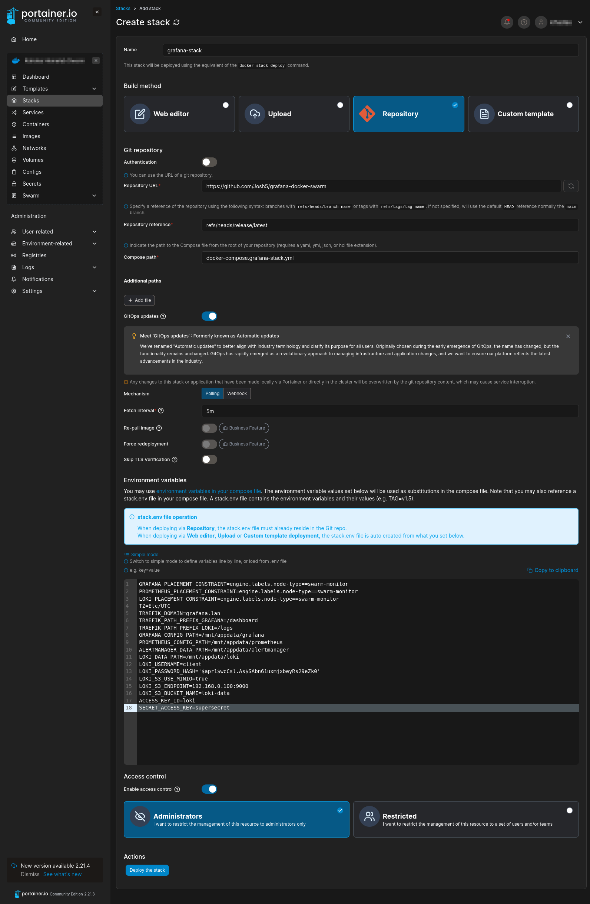
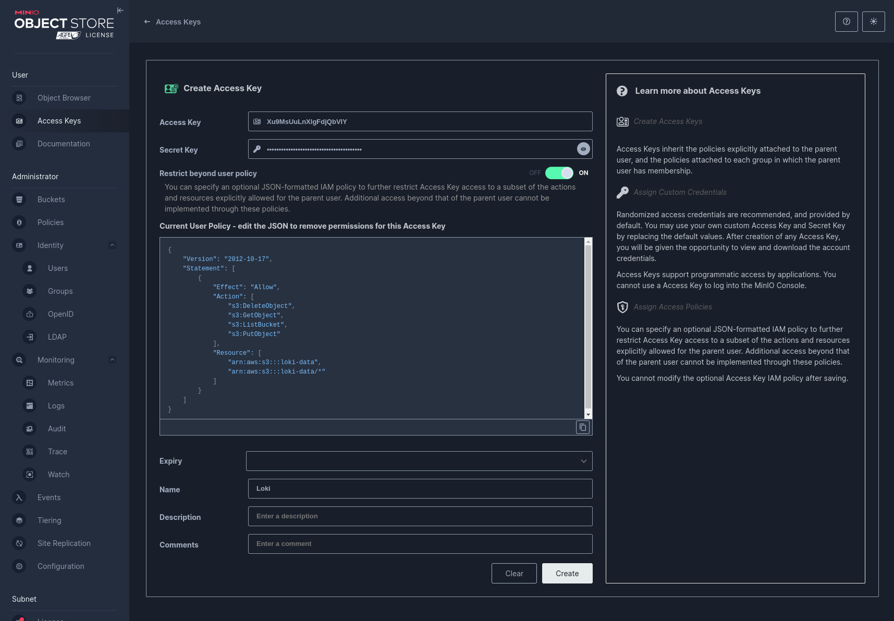

# Docker Swarm Stack Releases

## Setup Portainer

### Adding a stack

In the environment, add a new stack following these steps:

1. Name the stack according the the docker-compose YAML file name in this repo.
1. Configure the stack to pull from a git repository.
1. Enter in the details for this repo.
   - Repository URL: `https://github.com/Josh5/grafana-docker-swarm`
   - Repository reference: `refs/heads/release/latest`
1. Enter the name of the the docker-compose YAML file.
1. Enable GitOps updates.
1. Configure Polling updates with an interval of `5m`.
1. Configure Environment Variables. Refer to `**.env.example` files. Copy their contents into Portainer's **Environment variables** section (toggled to "Advanced mode") and edit as required.



## Setup MinIO

Follow these steps to setup an existing MinIO installation for Loki.

1. Create a new bucket named `loki-data` (or whatever you like)

1. Create a new Access Key

   - Set the **Name** to `Loki`.
   - Enable the toggle for "Restrict beyond user policy".
   - Add the following to the **Current User Policy** field:

     ```
     {
         "Version": "2012-10-17",
         "Statement": [
             {
                 "Effect": "Allow",
                 "Action": [
                     "s3:DeleteObject",
                     "s3:GetObject",
                     "s3:ListBucket",
                     "s3:PutObject"
                 ],
                 "Resource": [
                     "arn:aws:s3:::loki-data",
                     "arn:aws:s3:::loki-data/*"
                 ]
             }
         ]
     }
     ```

     

   - Copy the Access Key and Secret Key to the Stack **Environment variables** in Portainer (or in the `.env` file if running locally).
     ```
     #-  - ACCESS_KEY_ID -
     #-    The username for S3 bucket
     ACCESS_KEY_ID=
     #-  - SECRET_ACCESS_KEY -
     #-    The password for S3 bucket
     SECRET_ACCESS_KEY=
     ```
