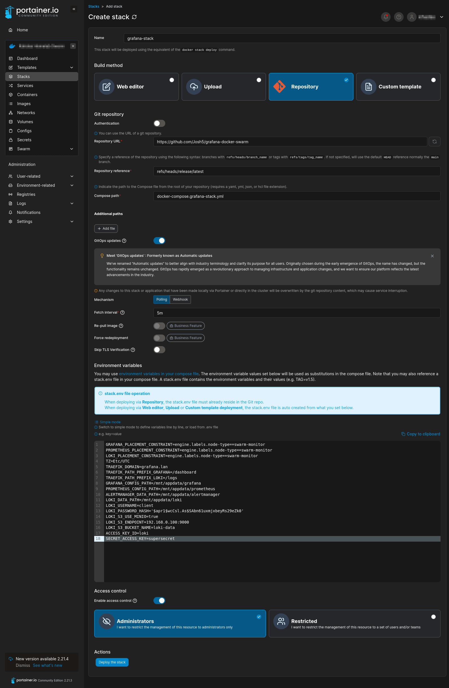
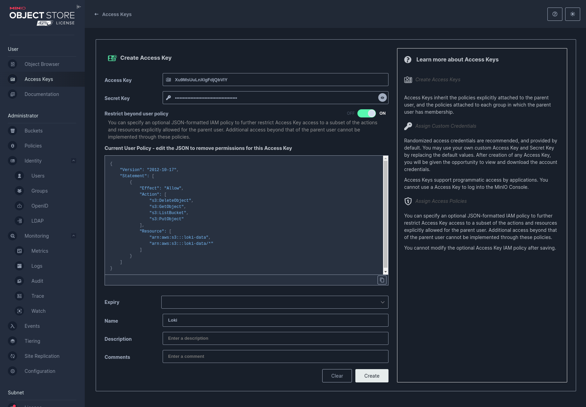

# Docker Swarm Stack Releases

## Setup Portainer

### Adding a stack

In the environment, add a new stack following these steps:

1. Name the stack according the the docker-compose YAML file name in this repo.
1. Configure the stack to pull from a git repository.
1. Enter in the details for this repo.
   - Repository URL: `<url>`
   - Repository reference: `refs/heads/<branch>`
1. Enter the name of the the docker-compose YAML file.
1. Enable GitOps updates.
1. Configure Polling updates with an interval of `5m`.
1. Configure Environment Variables. Refer to `**.env.example` files. Copy their contents into Portainer's **Environment variables** section (toggled to "Advanced mode") and edit as required.



## Setup MinIO

Follow these steps to setup an existing MinIO installation for Loki.

1. Create a new bucket named `loki-data` (or whatever you like)

1. Create a new Access Key
   - Set the **Name** to `Loki`.
   - Enable the toggle for "Restrict beyond user policy".
   - Add the following to the **Current User Policy** field:

     ```
     {
         "Version": "2012-10-17",
         "Statement": [
             {
                 "Effect": "Allow",
                 "Action": [
                     "s3:DeleteObject",
                     "s3:GetObject",
                     "s3:ListBucket",
                     "s3:PutObject"
                 ],
                 "Resource": [
                     "arn:aws:s3:::loki-data",
                     "arn:aws:s3:::loki-data/*"
                 ]
             }
         ]
     }
     ```

     

   - Copy the Access Key and Secret Key to the Stack **Environment variables** in Portainer (or in the `.env` file if running locally).
     ```
     #-  - ACCESS_KEY_ID -
     #-    The username for S3 bucket
     ACCESS_KEY_ID=
     #-  - SECRET_ACCESS_KEY -
     #-    The password for S3 bucket
     SECRET_ACCESS_KEY=
     ```

## Prometheus edge relay

Deploy `docker-compose.prometheus-edge-relay.yml` with the environment values generated from its header. The relay receives remote-write requests, buffers samples in its agent WAL and forwards them to `UPSTREAM_PROMETHEUS_REMOTE_WRITE_URL`. Keep its data directory on persistent storage.

### Memory and forwarding defaults

The queue defaults suit smaller deployments. Prometheus starts with one shard and can increase to four; it does not allocate the maximum shard count immediately. A full batch sends immediately, while the deadline flushes partial batches during quieter periods.

| Environment variable                          | Default | Purpose                                                                                                |
| :-------------------------------------------- | :------ | :----------------------------------------------------------------------------------------------------- |
| `EDGE_PROM_MEMORY_LIMIT`                      | `700M`  | Hard container memory limit; existing large WALs can require more during recovery.                     |
| `EDGE_PROM_GOMEMLIMIT_RATIO`                  | `0.70`  | Go soft memory target as a fraction of the container limit; must be greater than zero and at most one. |
| `EDGE_PROM_REMOTE_WRITE_MIN_SHARDS`           | `1`     | Initial forwarding concurrency; must not exceed the maximum.                                           |
| `EDGE_PROM_REMOTE_WRITE_MAX_SHARDS`           | `4`     | Maximum forwarding concurrency.                                                                        |
| `EDGE_PROM_REMOTE_WRITE_CAPACITY`             | `3000`  | Pending samples per shard; use three to ten times the batch size.                                      |
| `EDGE_PROM_REMOTE_WRITE_MAX_SAMPLES_PER_SEND` | `1000`  | Maximum samples per request.                                                                           |
| `EDGE_PROM_REMOTE_WRITE_BATCH_SEND_DEADLINE`  | `5s`    | Maximum wait before sending a partial batch.                                                           |
| `EDGE_PROM_RETENTION_TIME`                    | `6h`    | Maximum sample age before agent WAL truncation forcibly discards buffered samples.                     |

These defaults permit up to 16,000 samples across the queues and batches, compared with 600,000 using Prometheus 3.5's default maximum of 50 shards, capacity 10,000 and batches of 2,000. This comparison describes queue capacity, not total memory: retained series labels, incoming requests and WAL recovery also consume memory. The Go target encourages garbage collection and leaves headroom, but is not a hard process memory limit; reducing it can increase CPU usage and cannot shrink live series data.

### Sizing for more metrics

Start with the defaults and measure ingestion and successful forwarding. For example, four shards sending full 1,000-sample batches with one-second request latency have a theoretical ceiling of about 4,000 samples/second. This is a sizing estimate, not a benchmark; encoding, network latency, retries, upstream ingestion and CPU limits reduce achievable throughput. Backlog drainage needs spare capacity above the live incoming rate.

For higher throughput, try this profile and measure again:

```env
EDGE_PROM_REMOTE_WRITE_MIN_SHARDS=1
EDGE_PROM_REMOTE_WRITE_MAX_SHARDS=8
EDGE_PROM_REMOTE_WRITE_CAPACITY=6000
EDGE_PROM_REMOTE_WRITE_MAX_SAMPLES_PER_SEND=2000
EDGE_PROM_REMOTE_WRITE_BATCH_SEND_DEADLINE=5s
```

Increase `MAX_SHARDS` gradually when the queue needs more concurrency and the upstream receiver has capacity. Increasing `CAPACITY` buffers transient delays but does not increase receiver throughput. Prometheus 3.5's original queue defaults are `MAX_SHARDS=50`, `CAPACITY=10000` and `MAX_SAMPLES_PER_SEND=2000`; use those values only when measurements justify them and sufficient memory is available. See [Prometheus remote-write tuning](https://prometheus.io/docs/practices/remote_write/).

After metrics return, use `sum(rate(prometheus_remote_storage_samples_total[5m]))` for successfully forwarded samples/second, `prometheus_remote_storage_samples_pending` for samples waiting in queues, and `time() - prometheus_remote_storage_queue_highest_sent_timestamp_seconds` for delivery age. Give each relay unique external labels so its self-scraped metrics remain distinguishable. A growing queue or delivery age requires checking upstream errors and throughput; adding shards does not repair an unavailable upstream.

### Advanced configuration and recovery

`UPSTREAM_PROMETHEUS_REMOTE_WRITE_CONFIG` accepts extra YAML indented four spaces beneath the remote-write item. If it contains an explicit `queue_config`, that entire block replaces the queue variables above, preserving existing custom configurations without duplicate YAML keys. Unspecified fields in that custom block use Prometheus defaults, so include all queue fields needed for the smaller profile. Other settings, such as `write_relabel_configs`, can be supplied alongside the generated queue configuration.

Changing these variables takes effect when Portainer redeploys the updated template. Keep any temporary recovery memory allowance until the relay survives startup and the backlog is draining. Smaller queues limit forwarding buffers; they cannot guarantee that a large existing WAL recovers within the normal memory limit. Agent retention is applied during truncation after startup, so shortening it does not bypass the existing WAL replay and can discard unsent data. Do not delete WAL segments individually.

The `pidof` health check confirms that Prometheus is running, including during WAL replay; it does not establish readiness or successful forwarding. If receiver basic authentication is enabled, the built-in self-scrape also needs authentication through a custom scrape configuration; otherwise its `up` metric reports zero. Credentials must remain in deployment configuration, never in this repository.
